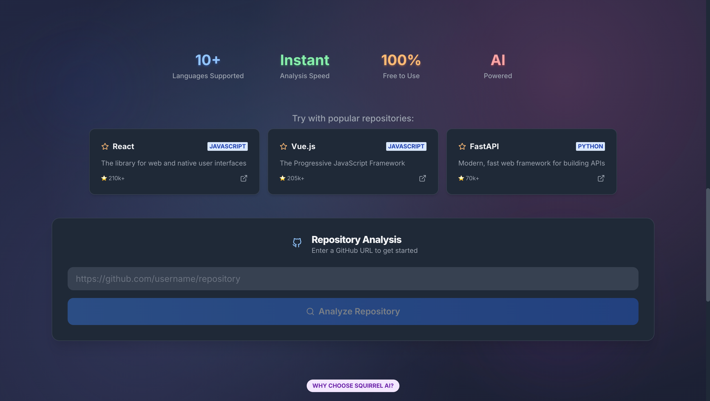
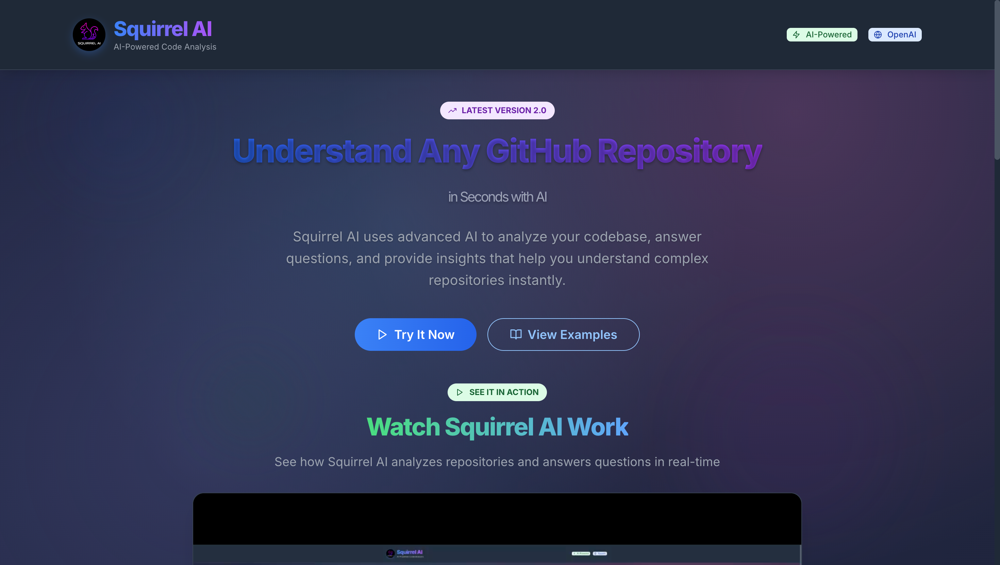
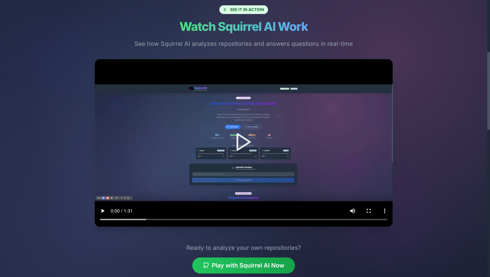
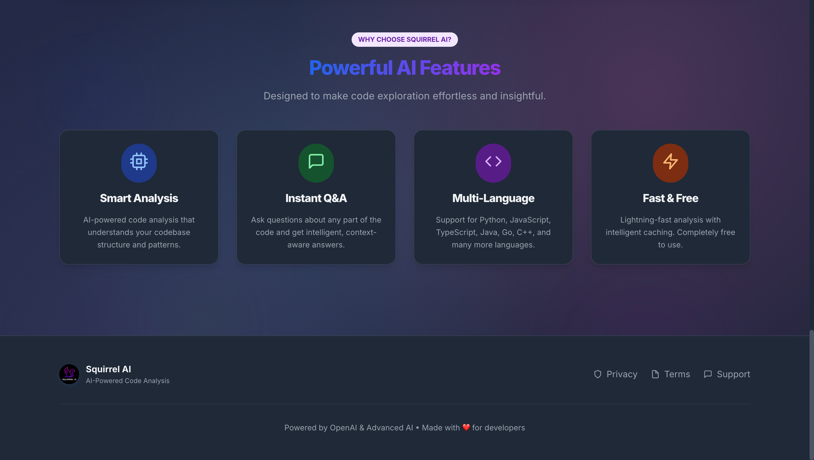

# Squirrel AI 🐿️

Squirrel AI is a playful, AI-powered developer hub that lets you play with any GitHub repository. Instantly analyze, explore, and ask questions about codebases using advanced AI. Built with a React frontend and FastAPI backend.


## ✨ Features

### 🎯 **Smart Repository Analysis**
- **AI-Powered Summaries**: Get comprehensive project overviews with tech stack analysis
- **Code Structure Extraction**: Automatic detection of functions, classes, and imports
- **Multi-Language Support**: Python, JavaScript, TypeScript, Java, Go, C++, C, Ruby, PHP, HTML, CSS
- **Project Statistics**: File counts, function/class analysis, and code metrics

### 💬 **Interactive Q&A**
- **Context-Aware Answers**: Ask specific questions about code implementation
- **File References**: See which files were used to generate answers
- **Code Pattern Recognition**: Understand architecture and design patterns
- **Developer-Friendly Responses**: Practical insights for codebase exploration

### 🎨 **Beautiful React UI**
- **Modern Design**: Clean, responsive interface with dark/light mode
- **Tabbed Interface**: Organized views for Summary, README, Code Structure, and Q&A
- **Real-time Updates**: Live progress indicators and status updates
- **Example Repositories**: Quick-start with popular open-source projects

### ⚡ **FastAPI Backend**
- **High Performance**: Async processing with optimized embeddings
- **Caching System**: Intelligent repository caching for faster subsequent analysis
- **RESTful API**: Clean, documented endpoints with automatic OpenAPI docs
- **Error Handling**: Robust error management and user-friendly messages

## 🎥 Demo

[▶️ **Watch Demo**](/demo.mp4)

[](/demo.mp4)

## 🖼️ Screenshots

|  |  |  |  |

## 🚀 Quick Start

### Prerequisites
- **Python 3.8+**
- **Node.js 16+**
- **npm or yarn**
- **Git**
- **OpenAI API Key**

### 1. Clone the Repository
```bash
git clone <your-repo-url>
cd squirrel-ai
```

### 2. Set Up Environment
```bash
# Create .env file
echo "OPENAI_API_KEY=your-actual-openai-api-key-here" > .env
echo "OPENAI_MODEL=gpt-3.5-turbo" >> .env
```

### 3. Install Dependencies
```bash
# Backend dependencies
cd backend
pip install -r requirements.txt

# Frontend dependencies
cd ../frontend
npm install
```

### 4. Start the Application
```bash
# Option 1: Use the startup script (recommended)
./start.sh

# Option 2: Start manually
# Terminal 1 - Backend
cd backend
python main.py

# Terminal 2 - Frontend
cd frontend
npm run dev
```

### 5. Access the Application
- **Frontend**: http://localhost:5173
- **Backend API**: http://localhost:8000
- **API Documentation**: http://localhost:8000/docs

## 📖 Usage Guide

### Analyzing a Repository
1. **Enter Repository URL**: Paste any GitHub repository URL
2. **Click "Analyze Repository"**: Wait for AI processing
3. **Explore Results**: Use the tabbed interface to view:
   - **Summary**: AI-generated project overview
   - **README**: Original README content
   - **Code Structure**: Functions, classes, and file analysis
   - **Q&A**: Ask questions about the codebase

### Asking Questions
1. **Navigate to Q&A Tab**: Click the "Q&A" tab
2. **Enter Your Question**: Ask specific questions like:
   - "How does authentication work?"
   - "What are the main components?"
   - "How is the data structured?"
   - "What design patterns are used?"
3. **Get AI Answers**: Receive context-aware responses with file references

### Example Questions
- "What is the main entry point of this application?"
- "How does error handling work in this codebase?"
- "What database is used and how is it configured?"
- "Explain the API structure and endpoints"
- "What testing framework is used?"

## 🛠️ Development

### Running in Development Mode
```bash
# Backend with auto-reload
cd backend
uvicorn main:app --reload --host 0.0.0.0 --port 8000

# Frontend with hot reload
cd frontend
npm run dev
```

### Building for Production
```bash
# Build frontend
cd frontend
npm run build

# Serve backend with production server
cd backend
uvicorn main:app --host 0.0.0.0 --port 8000
```

### Testing
```bash
# Backend tests
cd backend
python -m pytest

# Frontend tests
cd frontend
npm test
```

## 🔍 Troubleshooting

### Common Issues

**1. OpenAI API Errors**
```
Error: Invalid API key or quota exceeded
```
- Verify your OpenAI API key in `.env`
- Check your OpenAI account quota
- Ensure you have credits for the selected model

**2. Repository Cloning Issues**
```
Error: Failed to clone repository
```
- Check internet connection
- Verify repository URL is correct
- Ensure repository is public or you have access

**3. Frontend Connection Issues**
```
Error: Cannot connect to backend
```
- Ensure backend is running on port 8000
- Check CORS settings in backend
- Verify API_URL in frontend

**4. Memory Issues**
```
Error: Out of memory during analysis
```
- Reduce CHUNK_SIZE in backend settings
- Clear cached_repos directory
- Use smaller repositories for testing

---


